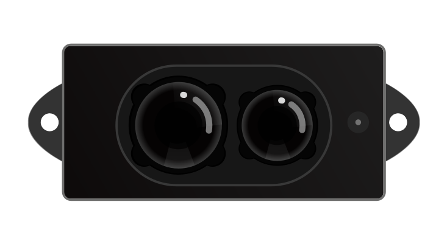

# DFRobot_LIDAR07

- [中文版](./README_CN.md)

This is a low-cost single-point TOF (Time of Flight) IR distance sensor for short-to-medium range distance measurement within 0.2m～12m. It adopts 850nm LED light source and unique designs of optical system, structure, and circuit. The integrated filtering algorithm could greatly reduce the measurement noise. The ranging module supports both I2C and UART communication, easy to be integrated into end products. Besides, it offers single passive measurement and continuous active measurement for meeting various requirements in actual use.



## Product Link(https://www.dfrobot.com/product-2281.html)
```
SKU：SEN0413
```


## Table of Contents

* [Summary](#Summary)
* [Installation](#installation)
* [Methods](#methods)
* [Compatibility](#compatibility)
* [History](#history)
* [Credits](#credits)

## Summary

This library provides two collection methods, one is single collection, the other is continuous collection. In continuous collection mode, you can set the collection frequency.


## Installation

There are two ways to use the library:
1. Open the Arduino IDE, search for "DFRobot_LIDAR07" in Tools --> Manager Libraries on the status bar, and install the library.
2. First download the library file, paste it into the \Arduino\libraries directory, then open the examples folder and run the demo in that folder.

## Methods

```C++
  /**
   * @fn begin
   * @brief  Detect whether the sensor is in normal communication and configure the sensor to single acquisition mode
   * @return true Indicate communication and sensor operating mode setting is successful，false Indicate communication is failed or get wrong information 
   */
  bool begin();

  /**
   * @fn getVersion
   * @brief Get the version information of the sensor
   * @return Return 32-bit data, low 16 bits are the minor version number, high 16 bits are the major version number
   */
  uint32_t getVersion();

  /**
   * @fn startMeasure
   * @brief  Start measurement
   */
  void startMeasure();
  
  /**
   * @fn getValue
   * @brief  Get the collected data
   * @return Whether the correct data has been obtained
   * @retval true (Successful)
   * @retval false (Failed)
   */
  bool getValue();

  /**
   * @fn setConMeasureFreq
   * @brief  Set specific measurement interval period
   * @param  frqe This parameter is valid only for continuous measurement, and the measurement period is set in ms. Minimum setting is 10MS (i.e. 100Hz)
   * @return Whether the frequency is set successfully
   * @retval true (Successful) 
   * @retval false (Failed)
   */
  bool setConMeasureFreq(uint32_t frqe);

  /**
   * @fn setMeasureMode
   * @brief  Set the sensor working mode
   * @param  mode The way data are collected
   * @n      eLidar07Single  A single collection
   * @n      eLidar07Continuous  Continuous acquisition
   * @return Check whether the working mode is set successfully 
   * @retval true (Successful) 
   * @retval false (Failed)
   */
  bool setMeasureMode(eLIDAR07CollectMode_t mode);

  /**
   * @fn getDistanceMM
   * @brief  Get the measured distance data, range: 0.2m-12m
   * @return Distance, unit: mm
   */
  uint16_t getDistanceMM();

  /**
   * @fn getSignalAmplitude
   * @brief  Get signal amplitude
   * @return signal amplitude
   */
  uint16_t getSignalAmplitude();

  /**
   * @fn startFilter
   * @brief  Enable filter function, this sensor has a lightweight filtering function inside
   * @return Whether the filter was set successfully
   * @retval true (successful)
   * @retval false (failed)
   */
  bool startFilter();

  /**
   * @fn stopFilter
   * @brief  Disable filter, this sensor has a lightweight filtering function inside
   * @return Whether the filter is successfully closed
   * @retval true (successful)
   * @retval false (failed)
   */
  bool stopFilter();

  
```
## Compatibility

### IIC

| MCU                | Work Well |         Work Wrong          | Untested | Remarks |
| ------------------ | :-------: | :-------------------------: | :------: | ------- |
| Arduino uno        |     √     |                             |          |         |
| FireBeetle esp32   |     √     |                             |          |         |
| FireBeetle esp8266 |     √     |                             |          |         |
| FireBeetle m0      |     √     |                             |          |         |
| Leonardo           |     √     |                             |          |         |
| Microbit           |           | √（Voltage not supported, data error large） |          |         |
| Arduino MEGA2560   |     √     |                             |          |         |

### UART

| MCU                | Work Well |           Work Wrong            | Untested | Remarks |
| ------------------ | :-------: | :-----------------------------: | :------: | ------- |
| Arduino uno        |           | √（The baud rate of the soft serial port is unstable at 115200） |          |         |
| FireBeetle esp32   |     √     |                                 |          |         |
| FireBeetle esp8266 |     √     |                                 |          |         |
| FireBeetle m0      |     √     |                                 |          |         |
| Leonardo           |     √     |                                 |          |         |
| Microbit           |           |                                 |          |Not support|
| Arduino MEGA2560   |     √     |                                 |          |         |


## History

- 2021/04/16 - Version 1.0.0 released.
- 2022/06/20 - Version 2.0.0 released.

## Credits

Written by yangfeng(feng.yang@dfrobot.com), 2022. (Welcome to our [website](https://www.dfrobot.com/))
